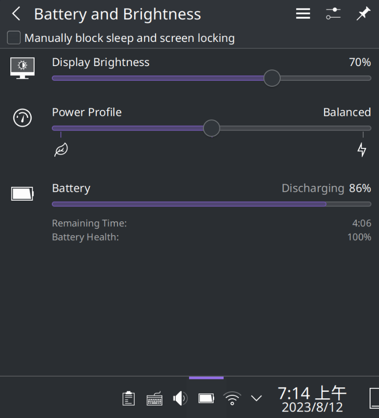

# Mechrevo WUJIE14 Linux Kernel Module (机械革命无界14/无界14+（IP3 xN39）Linux性能模式内核模块)


## What is this

This is a Linux kernel module for Mechrevo WUJIE14 laptop that implements a Linux platform profile driver and exports keyboard backlight level/shut-time sysfs attributes.

本Linux内核模块用于实现对机械革命无界14/无界14+的性能模式探测/调节，以及键盘背光时间的控制，应当适用于所有IP3 xN39模具的笔记本（如火影众颜U4，但我没有这款机器，如果读者可以测试，请不吝告知！）

## More detailed explainations on the purpose of this kernel module

### 1. Laptop performance mode and Linux platform profile interface

The Mechrevo WUJIE14 laptop has three performace modes namely quiet, balanced and rage which could be switched with key combination Fn+X. This switching is handled all by the emdedded controller(EC) that also serves as the keyboard controller thus is OS/software independent, i.e., without any need of some software, the EC itself is programmed to detect the key combination and do the switching, which is very ideal.

However the WUJIE14 does NOT have any hardware such as some LED light that gives the users an indication of what the current performance mode is. On Windows this problem is solved with a proprietary OSD software that shows the current performance mode whenever Fn+X is pressed(and consequently a wmi event notified). However with stock Linux the only way to tell this is by performing a stress test and checking the power consumption.

Luckily WUJIE14 has these performance mode related [wmi](https://www.kernel.org/doc/html/next/wmi/acpi-interface.html) methods and events implemented inside its ACPI table. Thus this kernel module first implements a linux platform profile driver that enables the user to:

- Read the current performance mode via `/sys/firmware/acpi/platform_profile` :

  ```shell
  $ cat /sys/firmware/acpi/platform_profile
  balanced
  ```
- Get a list of available perf modes via `/sys/firmware/acpi/platform_profile_choices`:

  ```shell
  $ cat /sys/firmware/acpi/platform_profile_choices
  quiet balanced performance
  ```
- Set the perf mode via `/sys/firmware/acpi/platform_profile`:

  ```shell
  $ echo 'quiet' | sudo tee /sys/firmware/acpi/platform_profile
  $ cat /sys/firmware/acpi/platform_profile
  quiet
  ```

The better part is that some Linux desktop environments(DE) implement GUI power profile tweaking tools on top of this standard interface. Taking KDE as example, with this kernel module loaded you could conveniently check and set the performance mode with the "Battery and Brightness" system tray entry:



### 2. Keyboard backlight brigtness level and auto-shutoff time configuring

The WUJIE14 has keyboard backlight with three brightness level off, dim and bright that could be switched by pressing Fn+F9 and this is also controlled by the EC. However a major problem with this backlight is that the backlight would automatically be turned off after 30 seconds and this auto-shutoff time cannot be easily altered without writing the EC ram. This kernel module then provides:

- A readonly sysfs attribute that reports the current backlight brightness level via `/sys/devices/pci0000:00/0000:00:14.3/PNP0C09:00/keyboard_backlight_level`:

  ```shell
  $ cat /sys/devices/pci0000:00/0000:00:14.3/PNP0C09:00/keyboard_backlight_level
  5C
  ```

  The possible values here are: 0 for off, 5C for dim and B8 for bright.
- A readwrite sysfs attribute that allows the users to set the auto-shutoff time via `/sys/devices/pci0000:00/0000:00:14.3/PNP0C09:00/keyboard_backlight_time`:

  ```shell
  # read the backlight time
  $ cat /sys/devices/pci0000:00/0000:00:14.3/PNP0C09:00/keyboard_backlight_time
  0
  ```

  The default value read is always zero after a cold system boot. Note that the last modification to the auto-shutoff time would persist across reboots since the EC won't be reset.

  ```shell
  # write the backlight time
  $ echo -1 | sudo tee /sys/devices/pci0000:00/0000:00:14.3/PNP0C09:00/keyboard_backlight_time
  ```

  Here the number written should be in range of signed char(s8), i.e., [-128,127] and it is only known that here 0 represents 30s, 1 represents 1 minute and -1 represents forever.

## Building, testing and installing

This project also serves as a demonstration of [Yet another cmake-kernel-module](https://github.com/xuwd1/yet-another-cmake-kernel-module), which aims at using cmake as a Linux kernel module build system generator and its main advantage is that with cmake generated `compile_commands.json` one could easily use some modern language server as `clangd` or `ccls` that brings code navigating/hinting functionalities.

### Building the kernel module `wujie14.ko`

Simply do the following:

```shell
$ mkdir build && cd build
$ cmake .. -DHEADER_BUILD=OFF -DDKMS=ON -G'Unix Makefiles'
$ make module
```

With `modinfo` you could check some details about the built module:

```shell
$ modinfo ./wujie14.ko
filename:       /blah/blah/mechrevo-wujie14-kmod/build/wujie14.ko
description:    mechrevo wujie 14 driver km
author:         David Xu
license:        GPL
srcversion:     FC2949389F1E779A82AFFB4
alias:          acpi*:PNP0C09:*
depends:        platform_profile,wmi
retpoline:      Y
name:           wujie14
vermagic:       6.4.10-arch1-1 SMP preempt mod_unload
```

Note that this module depends on symbols that `platform_profile` and `wmi` provides.

### Testing the kernel module

After building the `wujie14.ko`, you could now test it. First is to make sure that the dependee modules `platform_profile` and `wmi`

```shell
$ sudo modprobe platform_profile
$ sudo modprobe wmi
```

Then load the `wujie14.ko`:

```shell
$ sudo insmod wujie14.ko
```

Restart the `power-profile-daemon` and call the `powerprofilesctl`. If everything is right the `powerprofilesctl` should report like the following:

```shell
$ sudo systemctl restart power-profiles-daemon.service
$ powerprofilesctl
  performance:
    Driver:     platform_profile
    Degraded:   no

* balanced:
    Driver:     platform_profile

  power-saver:
    Driver:     platform_profile
```

And now you should be able to see the sysfs attributes this module gives. Please refer to [the previous section](#more-detailed-explainations-on-the-purpose-of-this-kernel-module). In addition, if running KDE, check the "Battery and Brightness" system tray entry and you should see a tweakable "Power Profile" bar now.

### Installing the module

There are two recommended methods to install the module.

#### 1. Installing with dkms

First make sure that the cmake project was configured with `-DDKMS` as the [above section](#building-the-kernel-module-wujie14ko) suggests. Under the `build` directory execute:

```shell
$ sudo make dkms-prepare
$ sudo make dkms-install
```

For the above make targets:

1. `dkms-prepare` copies the source files, generated `Kbuild` and the configured `dkms.conf` to `/usr/src/wujie14-km-$VER`
2. `dkms-install` calls the dkms to install the compressed kernel module `wujie14.ko.zst` to `/usr/lib/modules/$(uname -r)/extramodules` and execute `depmod`

After installing, call `sudo modprobe wujie14` and the module should be loaded. Additionally, if using systemd, you could create a file `/usr/lib/modules-load.d/wujie14.conf` with the following content:

```
wujie14
```

This enables the systemd to automatically load this module at boot time.

#### 2. (Arch only) AUR package

Just install the AUR package [mechrevo-wujie14-dkms](https://aur.archlinux.org/packages/mechrevo-wujie14-dkms). For example with `yay`:

```shell
$ yay -S mechrevo-wujie14-dkms
```

### Uninstalling the module

#### 1. You manually installed the module with dkms

In this case, manually revert everything that happened during installation is recommended:

1. Revert `dkms-prepare`, which means removing the module source files 

```shell
# replace VERSION with what you see, say wujie-km-0.1
$ sudo rm /usr/src/wujie-km-VERSION 
```

2. Revert `dkms-install`, which means (1) remove the kernel module from your kernel source tree, and (2) cleanup the dkms tree:

(1) This is where things gets a little tricky. Depending on the distro you are using, location that the kernel module `wujie14.ko.zst` was installed can VARY. I recommend just find it with `find`, then remove it.

```shell
$ cd /usr/lib/modules/$(uname -r)
$ sudo rm $(find . -iname 'wujie14.ko.zst' 2>/dev/null)
```

Then execute:

```shell
$ sudo depmod
```

(2) Cleanup the dkms tree

```shell
$ sudo rm -rf /var/lib/dkms/wujie14-km
```
After this, `wujie14-km` should not be listed in `dkms status` anymore.

3. If you have created the file `/usr/lib/modules-load.d/wujie14.conf`, just remove it:

```shell
$ sudo rm /usr/lib/modules-load.d/wujie14.conf
```

#### 2. (Arch only) You installed the AUR package

1. first use something like the below to remove the package

```shell
$ yay -Rus mechrevo-wujie14-dkms
```

2. You might want to additionally cleanup the dkms tree:

```shell
$ sudo rm -rf /var/lib/dkms/wujie14-km
```
